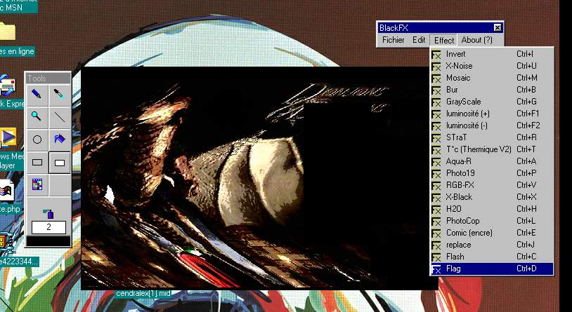



## Black\-FX \(a little photoshop\!\)

### Description

This code is an Image/photo editor witch allow you to transform, draw, all pictures you want!

It's composed of 19 effect like photoshop's plugins and 9 drawing tool like pen, brush, line, ... See screenshoot for more!
 
### More Info
 

             |
---                |---
**Submitted On**   |2001-10-04 22:54:28
**By**             |[BlackWizzard](https://github.com/Planet-Source-Code/PSCIndex/blob/master/ByAuthor/blackwizzard.md)
**Level**          |Advanced
**User Rating**    |4.8 (19 globes from 4 users)
**Compatibility**  |VB 5\.0, VB 6\.0
**Category**       |[Graphics](https://github.com/Planet-Source-Code/PSCIndex/blob/master/ByCategory/graphics__1-46.md)
**World**          |[Visual Basic](https://github.com/Planet-Source-Code/PSCIndex/blob/master/ByWorld/visual-basic.md)
**Archive File**   |[Black\-FX \(277711072001\.zip](https://github.com/Planet-Source-Code/blackwizzard-black-fx-a-little-photoshop__1-23539/archive/master.zip)

